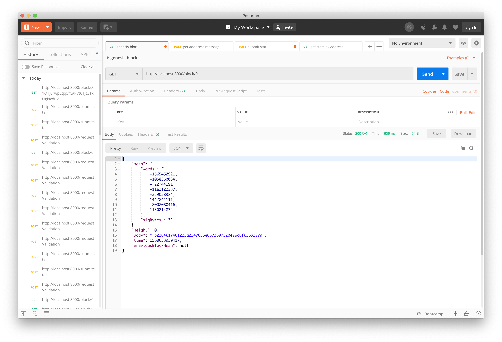
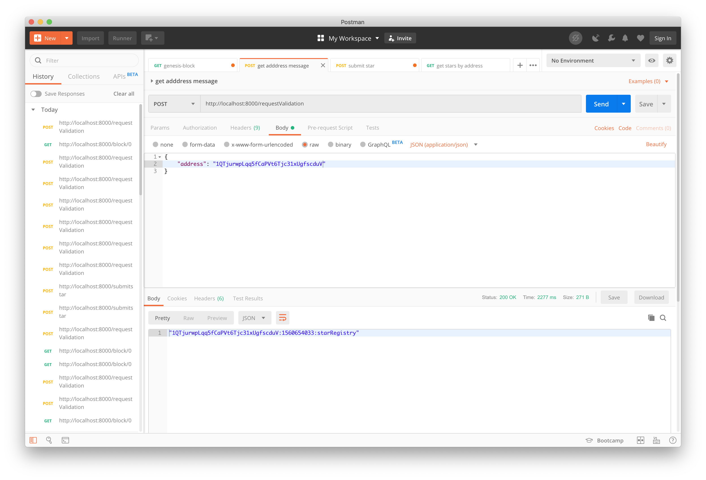
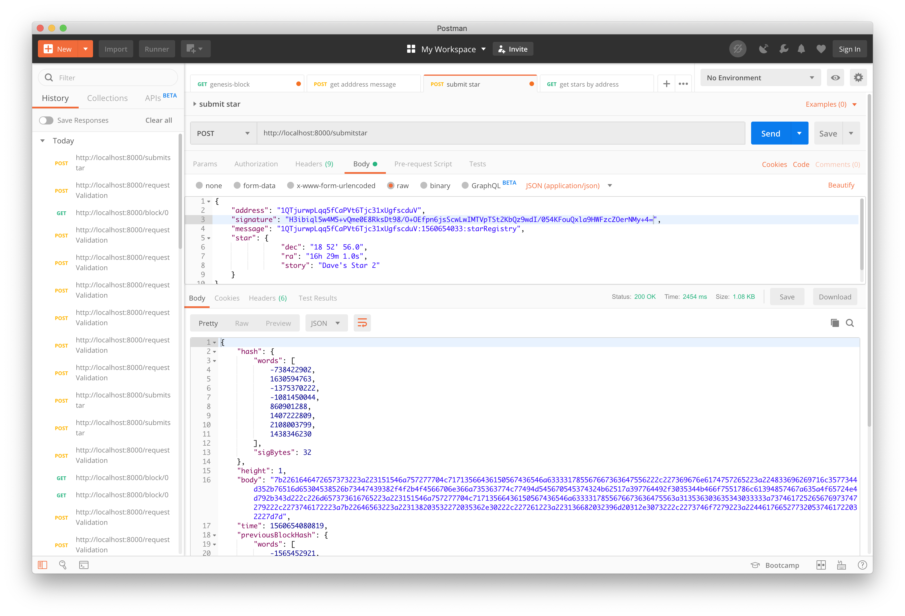
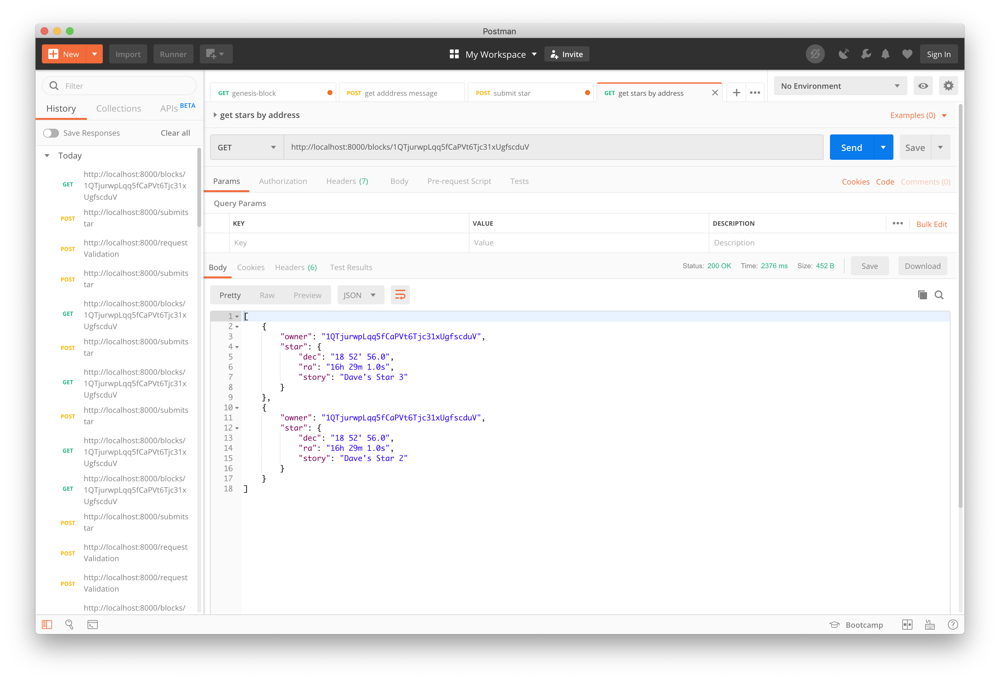

# Private Blockchain Application

This project was to build a simple private blockchain.

## App running using POSTMAN

1. Request the Genesis block:
    

2. Make  first request of ownership sending your wallet address:
    

3. Submit your Star
     

4. Retrieve Stars owned by me
    